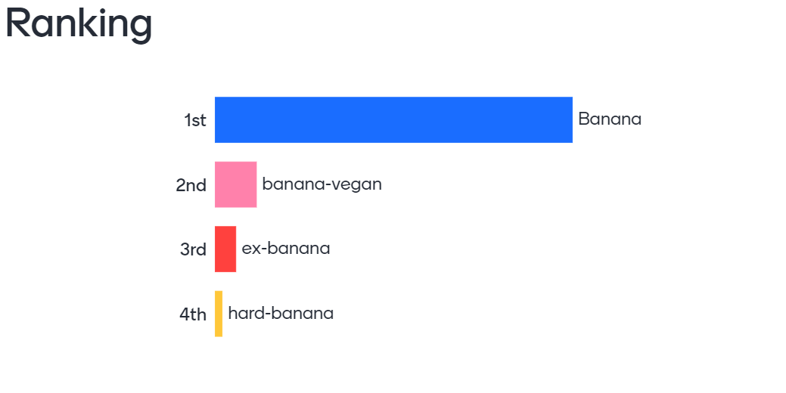
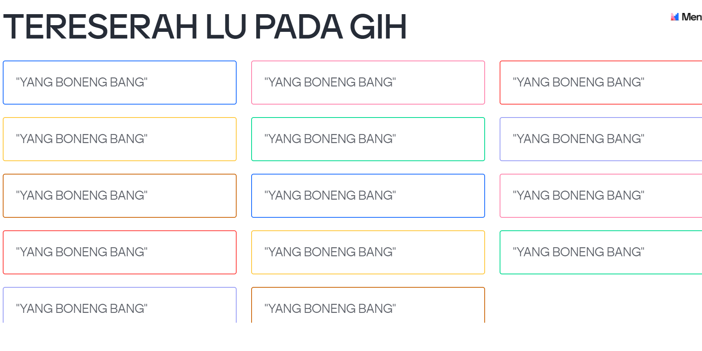
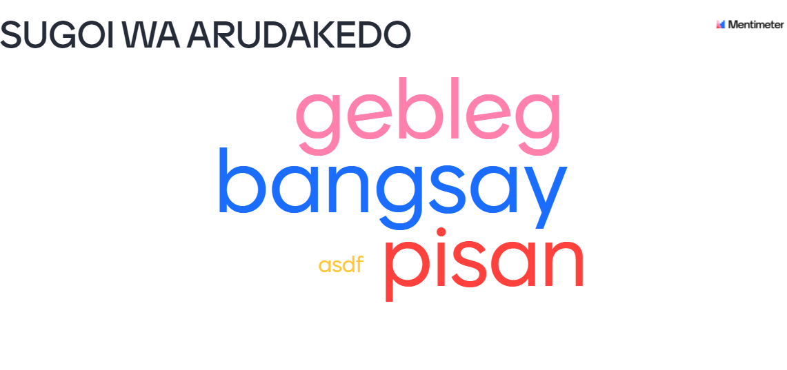
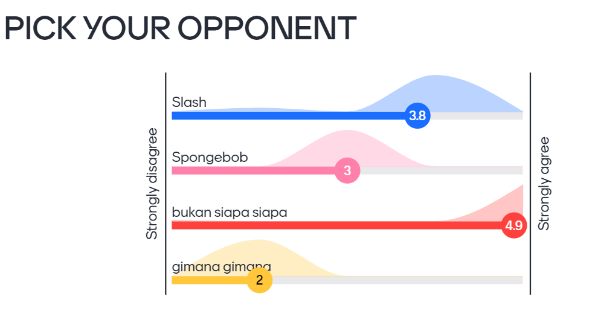
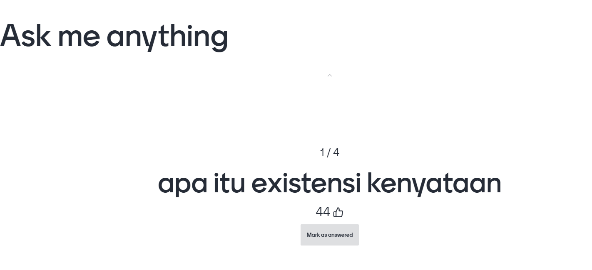
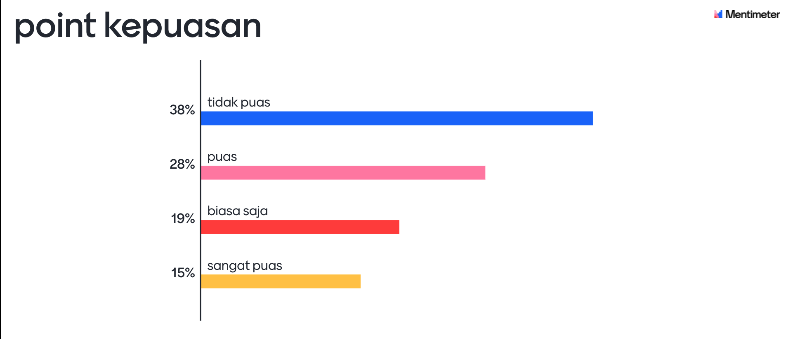
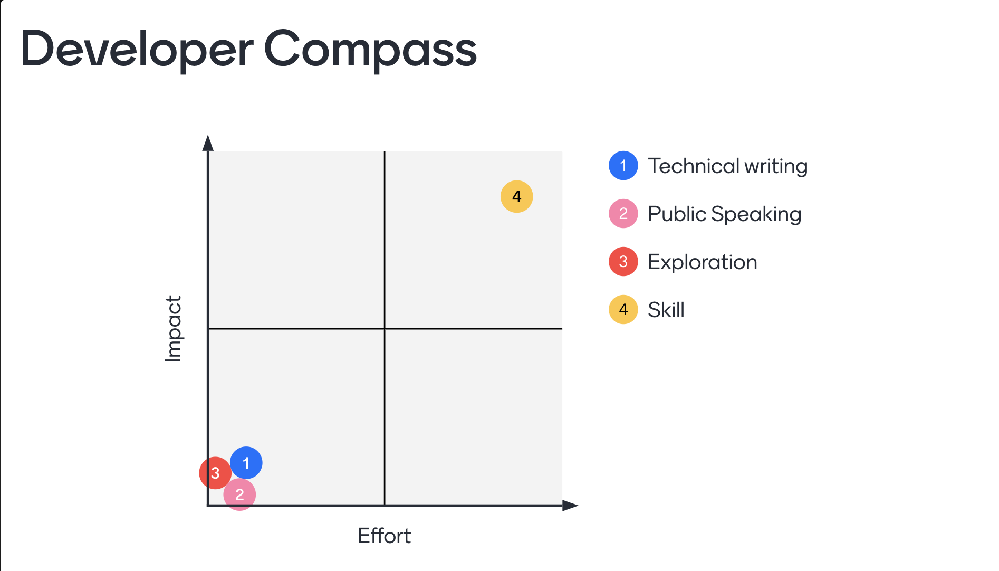

```
    _  ___  __  __    _   __      __   _
 _ | || __||  \/  |  /_\  \ \    / /  /_\
| || || _| | |\/| | / _ \  \ \/\/ /  / _ \
 \__/ |___||_|  |_|/_/ \_\  \_/\_/  /_/ \_\

Mentimeter Multiple Choice Spammer
```

I know this is stupid but its fun, my company using this to vote "something" for a fun event, so I think it will be fun to makes a good laugh for a day in front everyone.

and yeah

> DISCLAIMER or USE AT YOUR OWN RISK, These tools should be considered for educational and research purposes only, this tools is made not to violate the law or abuse the system. Any action you take by using this tools is strictly at your own risk. The creator is not responsible for any action

Click the video to see how it work.

[](https://www.youtube.com/watch?v=sVb0bos-vkQ "JEMAWA the mentimeter multiple choice vote spammer")

## How to use ?

```
pip3 install -r requirements.txt
```

and to run just simply

```
python3 dor.py <mentimeter vote page link>
```

ex:

```
python3 dor.py https://www.menti.com/lolrandom7
```

## Ranking Support

Now you can vote on ranking type



## Wordcloud and Open Support

now you can add wordcloud with spam vote, and also with open text





## Scales support

now you can spam the scales vote



## QFA question vote

now you can spam one of the question so it will have a bigger upvote



## QFA question vote

now you can spam one of the question so it will have a bigger upvote



## 2x2 grid vote

Now you can spam 2x2 grid vote



## Custom page vote

Now you can vote on any page not by only presented page, to do this you can run this

```
python3 dor.py <link> questions
```

to list the questions, after that get the question ID and run this

```
python3 dor.py <link> <questionID>
```

so it will continue like normal

## How this is work?

alright so you want to know, actually you can spam vote by creating a new session or a new identifier to every vote, you know its like whenver you want to vote, just simply open a new private browser, and vote.

so this is how program work.

1. We need to get which page is presented by presenter
2. get the content of the vote, ID and label
3. choose the ID to vite
4. tell the tools much vote you want
5. bot will get a new identifier for voting
6. and just vote.

## What is jemawa ?

indonesian word for 'arrogant'

## Contributors


